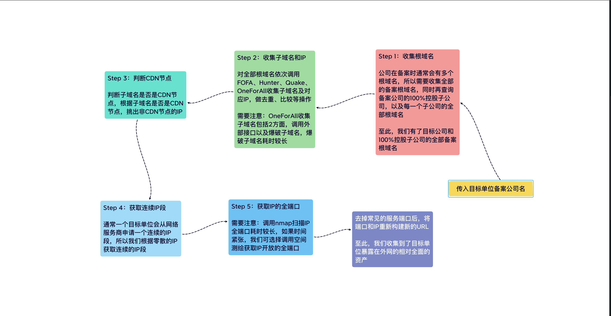

# 资产收集


## 0x01 根域名
借助[ENScan_GO](https://github.com/wgpsec/ENScan_GO)自动化收集根域名，包括：目标公司、目标公司的100%控股子公司、目标公司的分公司

## 0x02 子域名和IP
调用FOFA、Hunter、Quake、Zoomye、OneForAll收集子域名和ip

## 0x03 判断CDN节点

对于收集到的子域名，通过ping解析出对应ip，并判断出是否是cdn节点（或云waf节点），判断方法是对比ping后返回的域名和最初的域名是否一致，如
```
ping www.baidu.com
返回
PING www.a.shifen.com (39.156.66.14): 56 data bytes
则表示39.156.66.14是一个cdn节点
```

## 0x04 获取连续IP
得到非cdn节点（或云waf节点）的ip后，如1.1.1.1，1.1.1.3，1.1.1.5，那么往往1.1.1.2，1.1.1.4也属于目标，所以我们要通过一个算法实现获取连续ip，这个算法在几个知识星球里发过，这里也发一下

## 0x05 获取IP开放端口
此时收集到相对较全的ip，对每个ip查询全端口，这里调用nmap查询全端口会比较慢，可以先调用空间测绘查询ip全端口，最后将端口和ip结合，重新构造url

## 0x06 web爬虫及web路径

最后，对每个url进行网站爬取及web路径爆破，网站爬取推荐[crawlergo](https://github.com/Qianlitp/crawlergo)，web路径爆破推荐[dirsearch](https://github.com/maurosoria/dirsearch)

# 指纹识别

待放出

# 邮箱收集

待放出

# 敏感信息收集

待放出

